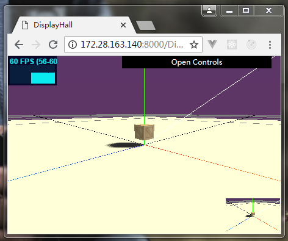

## threejs 教程

### usdful link
#### 官方threejs概念介绍 http://davidscottlyons.com/threejs-intro/
#### 凹凸工作室教程 https://aotu.io/notes/2017/08/28/getting-started-with-threejs/

### 简单入门例子
```html
<html>
  <head>
    <title>My first three.js app</title>
    <style>
      body { margin: 0; }
      canvas { width: 100%; height: 100% }
    </style>
  </head>
  <body>
    <!-- 引入threejs -->
    <script src="https://threejs.org/build/three.js"></script> 
    <script>
      var scene = new THREE.Scene(); // 创建舞台
      // 创建透视摄像机
      var camera = new THREE.PerspectiveCamera( 75, window.innerWidth/window.innerHeight, 0.1, 1000 );

      var renderer = new THREE.WebGLRenderer(); // 创建渲染器
      renderer.setSize( window.innerWidth, window.innerHeight ); // 设置渲染器大小
      document.body.appendChild( renderer.domElement ); // 添加在浏览器

      var geometry = new THREE.BoxGeometry( 1, 1, 1 ); // 创建盒子几何体
      var material = new THREE.MeshBasicMaterial( { color: 0x00ff00 } ); // 创建基础材质
      var cube = new THREE.Mesh( geometry, material ); // 创建一个基础材质正方体
      scene.add( cube ); // 添加到舞台

      camera.position.z = 5; // 设置摄像机位置

      // 申明动画函数
      var animate = function () {
        requestAnimationFrame( animate ); // 循环动画函数

        cube.rotation.x += 0.01; // 摄像机x轴旋转
        cube.rotation.y += 0.01; // 摄像机y轴旋转

        renderer.render( scene, camera ); // 渲染摄像看到的舞台
      };

      animate(); // 开启动画
    </script>
  </body>
</html>
```

### Tween.js动画应用
http://learningthreejs.com/blog/2011/08/17/tweenjs-for-smooth-animation/
```javascript
var coords = { x: camera.position.x, z: camera.position.z };
var tween = new TWEEN.Tween(coords)
    .to({
        x: box1.position.x + 4,
        z: box1.position.z - 4,
    }, 1000)
    .onUpdate(function () {
        camera.position.x = coords.x;
        camera.position.z = coords.z;
    })
    .start();
```

### 性能及调优问题

```js
// 渲染器renderer默认阴影，没有THREE.PCFShadowMap清晰
renderer.shadowMap.type = THREE.PCFSoftShadowMap;
// 移动端模糊问题，需要设置像素比
renderer.setPixelRatio(window.devicePixelRatio);

// scene有两个以上摄像机，为保证FPS，渲染时不能全部渲染，用户看不见的不渲染
```

<!--  -->
